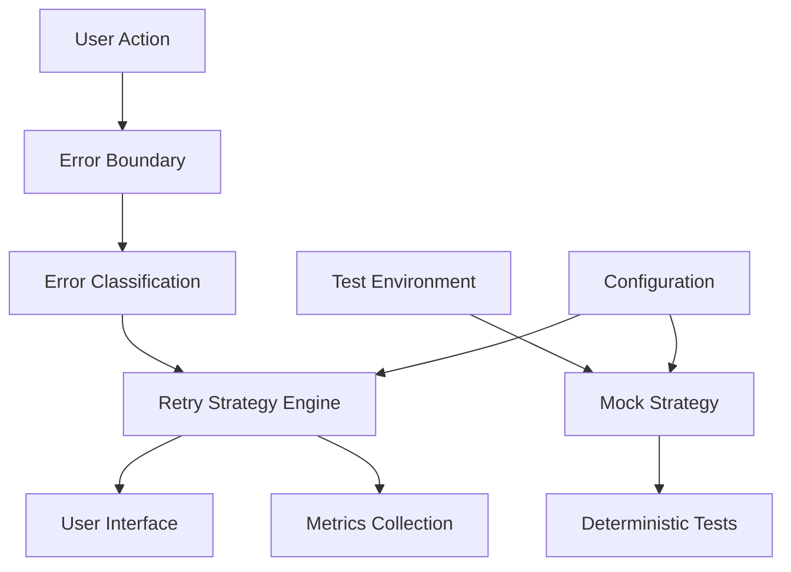
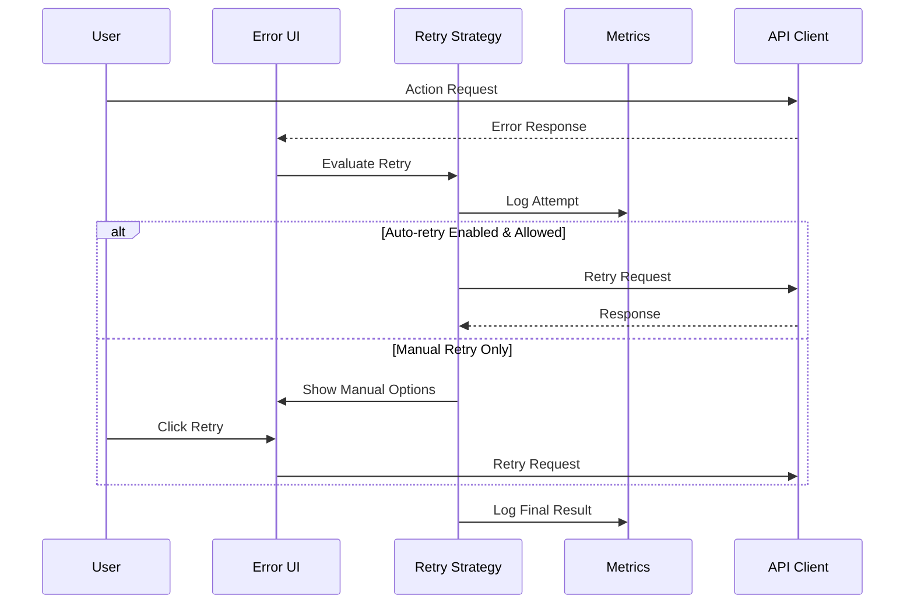

# Design Document

## Overview

This design addresses the critical issues identified in the current error handling implementation: unreliable tests with excessive timeouts and potentially harmful auto-retry behavior. The solution focuses on creating a robust, configurable, and user-friendly error handling system with comprehensive testing strategies.

## Architecture

### High-Level Architecture



### Component Interaction



## Components and Interfaces

### 1. Enhanced Error Configuration System

```typescript
interface ErrorHandlingConfig {
  autoRetry: {
    enabled: boolean;
    maxAttempts: number;
    baseDelay: number;
    maxDelay: number;
    exponentialBase: number;
  };
  testing: {
    mockEnabled: boolean;
    timeoutMs: number;
    deterministicMode: boolean;
  };
  metrics: {
    enabled: boolean;
    anonymousCollection: boolean;
  };
}
```

### 2. Retry Strategy Engine

```typescript
interface RetryStrategy {
  shouldRetry(error: Error, attempt: number, context: OperationContext): boolean;
  getDelay(attempt: number, errorType: ErrorType): number;
  canAutoRetry(errorType: ErrorType, userPreferences: UserPreferences): boolean;
}

interface OperationContext {
  type: 'create' | 'update' | 'delete' | 'fetch' | 'toggle';
  userId?: string;
  sessionId: string;
  timestamp: number;
}
```

### 3. Test Mock Strategy

```typescript
interface TestMockStrategy {
  createNetworkErrorMock(delay?: number): Promise<never>;
  createServerErrorMock(statusCode: number): Promise<never>;
  createSuccessAfterRetries(failCount: number): Promise<any>;
  createTimeoutMock(): Promise<never>;
}
```

### 4. Metrics Collection System

```typescript
interface ErrorMetrics {
  recordError(error: Error, context: OperationContext): void;
  recordRetryAttempt(attempt: number, success: boolean, duration: number): void;
  getErrorStats(): ErrorStatistics;
  shouldAdjustStrategy(): boolean;
}
```

## Data Models

### Error Classification

```typescript
enum ErrorSeverity {
  LOW = 'low',           // Validation errors, user input issues
  MEDIUM = 'medium',     // Network timeouts, temporary server issues
  HIGH = 'high',         // Server errors, authentication failures
  CRITICAL = 'critical'  // System failures, data corruption
}

interface ClassifiedError {
  originalError: Error;
  type: ErrorType;
  severity: ErrorSeverity;
  retryable: boolean;
  autoRetryAllowed: boolean;
  suggestedDelay: number;
}
```

### Retry State Management

```typescript
interface RetryState {
  operationId: string;
  attempts: number;
  maxAttempts: number;
  lastAttemptTime: number;
  nextAttemptTime: number;
  isAutoRetrying: boolean;
  canCancel: boolean;
  errors: Error[];
}
```

## Error Handling

### 1. Error Classification Strategy

- **Network Errors**: Auto-retry with exponential backoff, max 3 attempts
- **Server Errors (5xx)**: Longer delays (5-30 seconds), limited auto-retry
- **Client Errors (4xx)**: No auto-retry, immediate user feedback
- **Validation Errors**: No retry, focus on user guidance

### 2. Retry Decision Matrix

| Error Type | Auto-Retry | Max Attempts | Base Delay | Max Delay |
|------------|------------|--------------|------------|-----------|
| Network    | Optional   | 3            | 1s         | 8s        |
| Server 5xx | Optional   | 2            | 5s         | 30s       |
| Timeout    | Optional   | 3            | 2s         | 16s       |
| Client 4xx | Never      | 0            | -          | -         |
| Validation | Never      | 0            | -          | -         |

### 3. User Control Mechanisms

- **Global Setting**: Enable/disable auto-retry
- **Per-Operation Control**: Cancel ongoing retries
- **Context Awareness**: Disable auto-retry on mobile/low battery
- **Feedback Loop**: Learn from user retry patterns

## Testing Strategy

### 1. Mock-Based Testing Approach

```typescript
// Replace unreliable network-dependent tests
describe('Error Handling', () => {
  beforeEach(() => {
    vi.mocked(apiClient.getTodos).mockReset();
  });

  it('should handle network errors gracefully', async () => {
    // Mock network error - no actual network call
    vi.mocked(apiClient.getTodos).mockRejectedValue(
      new Error('Network error')
    );

    render(<TodoList />);
    
    // Fast, deterministic test - no waiting for timeouts
    expect(await screen.findByText(/unable to connect/i)).toBeInTheDocument();
    expect(screen.getByRole('button', { name: /try again/i })).toBeInTheDocument();
  });
});
```

### 2. Retry Logic Testing

```typescript
// Test retry logic without actual delays
describe('Retry Strategy', () => {
  it('should implement exponential backoff', () => {
    const strategy = new RetryStrategy();
    
    expect(strategy.getDelay(1, 'network')).toBe(1000);
    expect(strategy.getDelay(2, 'network')).toBe(2000);
    expect(strategy.getDelay(3, 'network')).toBe(4000);
  });

  it('should respect max attempts', () => {
    const strategy = new RetryStrategy();
    
    expect(strategy.shouldRetry(networkError, 1, context)).toBe(true);
    expect(strategy.shouldRetry(networkError, 3, context)).toBe(true);
    expect(strategy.shouldRetry(networkError, 4, context)).toBe(false);
  });
});
```

### 3. Integration Testing with Controlled Scenarios

```typescript
// Fast integration tests with predictable behavior
describe('Error Integration', () => {
  it('should complete error flow in under 2 seconds', async () => {
    const startTime = Date.now();
    
    // Use fast mocks instead of real delays
    mockApiClient.setupNetworkErrorScenario();
    
    render(<App />);
    
    // Trigger error and verify handling
    fireEvent.click(screen.getByText('Load Data'));
    
    await waitFor(() => {
      expect(screen.getByText(/unable to connect/i)).toBeInTheDocument();
    });
    
    const duration = Date.now() - startTime;
    expect(duration).toBeLessThan(2000);
  });
});
```

### 4. Test Configuration

```typescript
// vitest.config.ts improvements
export default defineConfig({
  test: {
    environment: 'jsdom',
    setupFiles: ['./src/test/setup.ts'],
    testTimeout: 5000, // Reduced from 20000
    mockReset: true,
    clearMocks: true,
  }
});
```

## Implementation Strategy

### Phase 1: Test Stabilization
1. Replace network-dependent tests with mocks
2. Reduce test timeouts to reasonable limits (5s max)
3. Implement deterministic error simulation
4. Add comprehensive mock strategies

### Phase 2: Retry Strategy Refinement
1. Implement configurable retry engine
2. Add user control mechanisms
3. Implement smart retry decision logic
4. Add metrics collection

### Phase 3: User Experience Enhancement
1. Improve retry feedback UI
2. Add cancellation capabilities
3. Implement context-aware retry behavior
4. Add user preference learning

### Phase 4: Monitoring and Optimization
1. Implement comprehensive metrics
2. Add performance monitoring
3. Implement adaptive retry strategies
4. Add diagnostic tools

## Performance Considerations

### Test Performance
- **Target**: All error handling tests complete in under 5 seconds
- **Strategy**: Mock all external dependencies
- **Monitoring**: Track test execution times in CI/CD

### Runtime Performance
- **Memory**: Limit retry state storage to active operations only
- **CPU**: Efficient error classification algorithms
- **Network**: Intelligent retry timing to avoid server overload

### User Experience
- **Responsiveness**: Immediate feedback for all user actions
- **Battery**: Context-aware retry behavior on mobile devices
- **Bandwidth**: Respect user's network conditions

## Security Considerations

### Data Privacy
- Anonymous metrics collection only
- No sensitive data in error logs
- User consent for telemetry

### Rate Limiting
- Respect server rate limits
- Implement client-side throttling
- Coordinate retry attempts across tabs/windows

### Error Information Disclosure
- Sanitize error messages for production
- Limit technical details exposure
- Secure error reporting channels