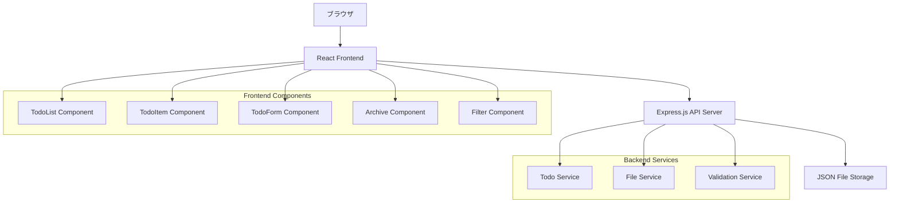

# デザイン文書

## 概要

todoアプリケーションは、ユーザーがタスクを効率的に管理できるWebベースのシングルページアプリケーション（SPA）として設計されます。React + TypeScriptをフロントエンド、Express.js + Node.jsをバックエンドとして使用し、JSONファイルベースのデータストレージを採用します。

## アーキテクチャ

### システム構成



### 技術スタック

- **フロントエンド**: React 18, TypeScript, CSS Modules
- **バックエンド**: Node.js, Express.js, TypeScript
- **データストレージ**: JSON ファイル (./server/data/tasks.json)
- **開発ツール**: Vite, ESLint, Prettier

## コンポーネントとインターフェース

### データモデル

```typescript
interface TodoItem {
  id: string;
  title: string;
  completed: boolean;
  priority: 'high' | 'medium' | 'low';
  tags: string[];
  createdAt: string; // ISO 8601 format
  updatedAt: string; // ISO 8601 format
  memo: string;
  completedAt: string | null; // ISO 8601 format
}

interface TodoFilter {
  status?: 'all' | 'pending' | 'completed';
  priority?: 'high' | 'medium' | 'low';
  tags?: string[];
  searchText?: string;
}

interface ArchiveGroup {
  date: string; // YYYY-MM-DD format
  tasks: TodoItem[];
  count: number;
}
```

### APIエンドポイント

```
GET    /api/todos              - 全てのtodoアイテムを取得
POST   /api/todos              - 新しいtodoアイテムを作成
PUT    /api/todos/:id          - 既存のtodoアイテムを更新
DELETE /api/todos/:id          - todoアイテムを削除
GET    /api/todos/archive      - 完了済みtodoアイテムをアーカイブ形式で取得
GET    /api/tags               - 使用されているタグ一覧を取得
```

### フロントエンドコンポーネント

#### 1. App Component
- アプリケーションのルートコンポーネント
- ルーティングとグローバル状態管理
- ビュー切り替え（通常ビュー/アーカイブビュー）

#### 2. TodoList Component
- todoアイテムのリスト表示
- フィルタリング機能
- 並び替え機能（優先度、作成日時）

#### 3. TodoItem Component
- 個別のtodoアイテム表示
- 完了状態の切り替え
- インライン編集機能
- 削除機能

#### 4. TodoForm Component
- 新規todoアイテム作成フォーム
- 編集モード対応
- バリデーション機能

#### 5. Archive Component
- 完了済みtodoアイテムの表示
- 完了日によるグルーピング
- 日付順ソート（新しい順）

#### 6. Filter Component
- ステータスフィルター
- 優先度フィルター
- タグフィルター
- テキスト検索

#### 7. TagManager Component
- タグの追加・削除
- 既存タグの選択
- タグのオートコンプリート

#### 8. MemoEditor Component
- マークダウンエディター
- プレビュー機能
- リアルタイムレンダリング

## データモデル

### TodoItem詳細設計

```typescript
interface TodoItem {
  id: string;                    // UUID v4形式
  title: string;                 // 必須、最大200文字
  completed: boolean;            // デフォルト: false
  priority: Priority;            // デフォルト: 'medium'
  tags: string[];               // 空配列可、各タグ最大50文字
  createdAt: string;            // ISO 8601形式、自動生成
  updatedAt: string;            // ISO 8601形式、自動更新
  memo: string;                 // 空文字可、マークダウン対応
  completedAt: string | null;   // 完了時のみ設定
}

type Priority = 'high' | 'medium' | 'low';
```

### データ永続化

- JSONファイル（./server/data/tasks.json）を使用
- ファイル読み書きの排他制御
- バックアップ機能（自動保存前にバックアップ作成）
- データ整合性チェック

## エラーハンドリング

### フロントエンド

1. **ネットワークエラー**
   - API通信失敗時のリトライ機能
   - ユーザーフレンドリーなエラーメッセージ表示
   - オフライン状態の検知と通知

2. **バリデーションエラー**
   - リアルタイムバリデーション
   - フィールド単位のエラー表示
   - フォーム送信前の総合チェック

3. **状態管理エラー**
   - 楽観的更新とロールバック
   - 状態の不整合検知
   - 自動リフレッシュ機能

### バックエンド

1. **ファイルI/Oエラー**
   - ファイル読み書き失敗時の適切なHTTPステータス返却
   - ログ出力とエラー追跡
   - データ復旧機能

2. **データバリデーションエラー**
   - 入力データの厳密なバリデーション
   - 詳細なエラーメッセージ
   - セキュリティ対策（XSS、インジェクション防止）

3. **システムエラー**
   - 予期しないエラーのキャッチ
   - グレースフルシャットダウン
   - ヘルスチェック機能

## テスト戦略

### 単体テスト

1. **フロントエンド**
   - React Testing Library使用
   - コンポーネントの動作テスト
   - カスタムフックのテスト
   - ユーティリティ関数のテスト

2. **バックエンド**
   - Jest使用
   - APIエンドポイントのテスト
   - サービス層のテスト
   - データバリデーションのテスト

### 統合テスト

1. **API統合テスト**
   - Supertest使用
   - エンドツーエンドのAPI動作確認
   - エラーケースのテスト

2. **E2Eテスト**
   - Playwright使用
   - ユーザーシナリオベースのテスト
   - ブラウザ間互換性テスト

### テストカバレッジ

- 単体テスト: 80%以上
- 統合テスト: 主要機能の100%
- E2Eテスト: クリティカルパスの100%

## パフォーマンス考慮事項

### フロントエンド最適化

1. **レンダリング最適化**
   - React.memo使用による不要な再レンダリング防止
   - useMemo、useCallbackによる計算結果キャッシュ
   - 仮想化による大量データ表示最適化

2. **バンドル最適化**
   - コード分割（React.lazy）
   - Tree shaking
   - 画像最適化

### バックエンド最適化

1. **データアクセス最適化**
   - ファイル読み込みキャッシュ
   - 差分更新による書き込み最適化
   - インメモリキャッシュ

2. **API最適化**
   - レスポンス圧縮
   - 適切なHTTPキャッシュヘッダー
   - レート制限

## セキュリティ考慮事項

### 入力検証

- すべての入力データの厳密なバリデーション
- XSS攻撃防止（HTMLエスケープ）
- SQLインジェクション防止（該当しないがベストプラクティスとして）

### データ保護

- 機密情報の適切な取り扱い
- ログ出力時の個人情報マスキング
- セキュアなHTTPヘッダー設定

### アクセス制御

- CORS設定
- CSP（Content Security Policy）設定
- セキュリティヘッダーの適用

## 国際化対応

### 多言語サポート

- React i18next使用
- 日本語・英語対応
- 動的言語切り替え

### 地域化

- 日時フォーマットの地域対応
- タイムゾーン考慮
- 数値・通貨フォーマット

## アクセシビリティ

### WCAG 2.1 AA準拠

- セマンティックHTML使用
- キーボードナビゲーション対応
- スクリーンリーダー対応
- 適切なコントラスト比
- フォーカス管理

### ユーザビリティ

- レスポンシブデザイン
- タッチデバイス対応
- 直感的なUI/UX
- ローディング状態の表示